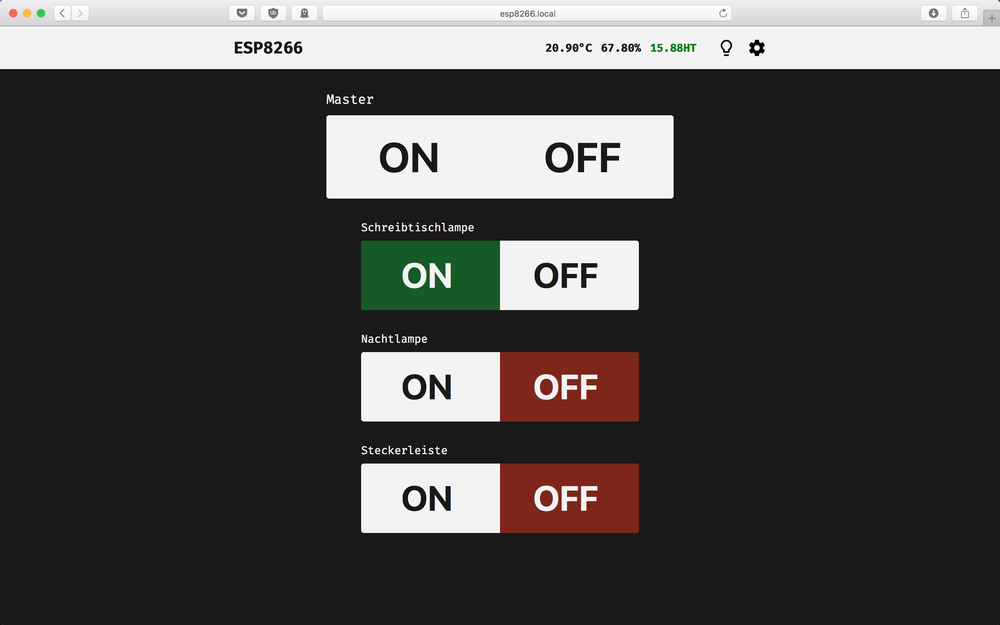

# esp8266-smartclock

We started designing and building a small clock that is connected to your local Wifi and controls your home using cheap 433Mhz power outlets. The ESP8266 operates as a relay to communicate with your power outlets.





## Hardware
The total costs are around 20€:

* NodeMCU board
* DHT11 (optional)
* 433Mhz transmitter
* 3x MAX7219 based 8x8 led matrix
* Wireless Remote Control Electrical Outlet Switch (working on 433Mhz)
* some wires

## Features
* opens an access point to enter your local Wifi SSID and password
* customisable slots for your outlets
* custom brightness settings for the LED matrix
* Read Data from a DHT11 temperature and humidity sensor
* NTP Time support
* supports multiple Wireless Remote Control protocols (We are using the <a href="https://github.com/sui77/rc-switch">rc-switch</a> library)
* dyndns (making a get request on a given url every 10 minutes)
* password-authentication for user from the internet (no https 😞)
* OverTheAir Update

### Update via OTA
```
curl -u admin:admin -F "image=@/tmp/arduino_build_*/ESP_clock.ino.bin" esp8266/update
```
or via webinterface at `http://esp8266/update`

## Ideas for the future
* a light sensor could turn on the lights automatically
* a proper case (3D printed, wood...)
