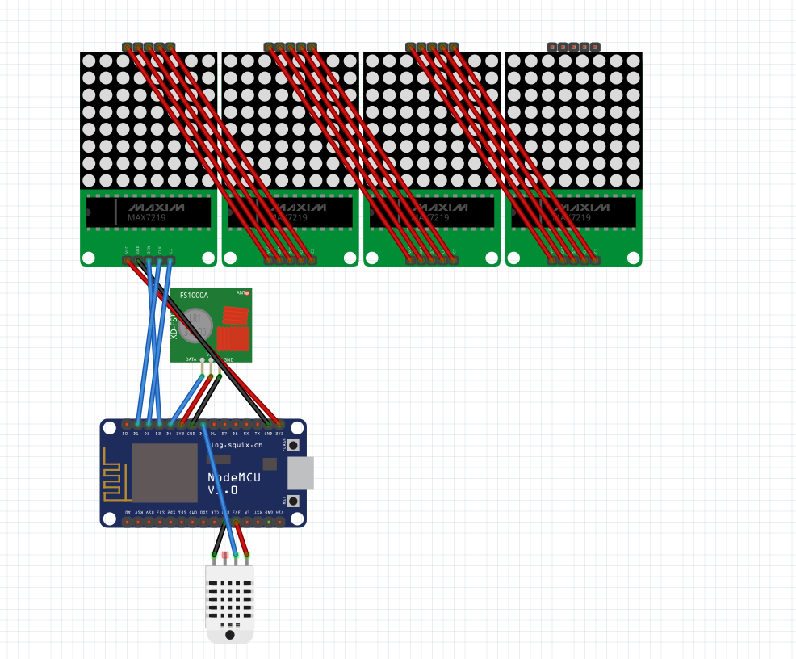

# esp8266-smartclock

We started designing and building a small clock that is connected to your local Wifi and controls your home using cheap 433Mhz power outlets. The ESP8266 operates as a relay to communicate with your power outlets.


## Hardware
The total costs are around 25€:

* NodeMCU board with the ESP8266 and an USB programmer
* DHT11 or DHT22 (optional)
* 433Mhz transmitter (XD-RF-5V)
* 4x MAX7219 based 8x8 led matrix
* 433mhz Wireless Remote Control Electrical Outlet Switch (<a href="https://www.amazon.de/dp/B001AX8QUM/ref=cm_sw_em_r_mt_dp_Abo7zbDRGS07B">example</a>) 
* some wires

### Schematic

<a href="esp8266_smartclock.fzz">Fritzing File</a>


## Features
* opens an access point to enter your local Wifi SSID and password
* customisable slots for your power outlets
* custom brightness settings for the LED matrix
* Read Data from a DHT11 temperature and humidity sensor and send it to a remote Host (for saving the data see: sensor.php)
* NTP Time support
* supports multiple Wireless Remote Control protocols (we are using the <a href="https://github.com/sui77/rc-switch">rc-switch</a> library)
* dyndns (using a get request on a given url every 10 minutes)
* password-authentication for user from the internet (no https 😞)
* OverTheAir Update

## Development

### Dependencies

| Module                                                       | last tested version |
| ------------------------------------------------------------ | ------------------- |
| [ESP8266](https://github.com/esp8266/Arduino)                | 2.7.1               |
| [NTPClient](https://github.com/arduino-libraries/NTPClient)  | 3.2.0               |
| [Adafruit_Sensor](https://github.com/adafruit/Adafruit_Sensor) | 1.1.3               |
| [DHT-sensor-library](https://github.com/adafruit/DHT-sensor-library) | 1.3.10              |
| [LedControl](http://wayoda.github.io/LedControl/)            | 1.0.6               |
| [rc-switch](https://github.com/sui77/rc-switch)              | 2.6.3               |
| [Time](http://playground.arduino.cc/code/time)               | 1.6.0               |

### Board-Settings (used)

- Board: NodeMCU 1.0 (ESP-12E Module)
- Builtin Led: 2
- Upload Speed: 115200
- CPU Frequency: 80Mhz
- Flash Size: 4MB (FS:1MB OTA:~1019KB)
- Debug Port: Disabled
- Debug Level: None
- lwIP Variant: v2 Lower Memory
- VTables: Flash
- Exceptions: Enabled
- Erase Flash: Only Sketch
- SSL Support: All SSL ciphers (most compatible)

### Compile
```
arduino ./ESP_clock/ESP_clock.ino --verify --preserve-temp-files
```

### Update via OTA
```
curl -u admin:admin -F "image=@$(find /tmp/arduino* -name 'ESP_clock.ino.bin')" esp8266/update
```
or via webinterface at `http://esp8266/update`
