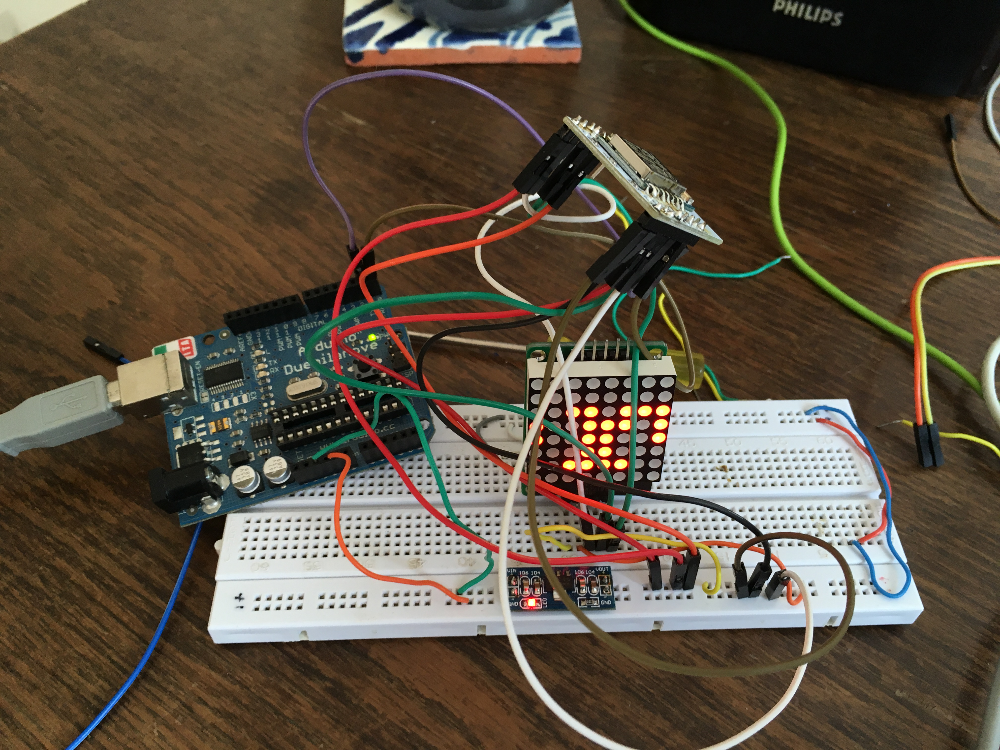
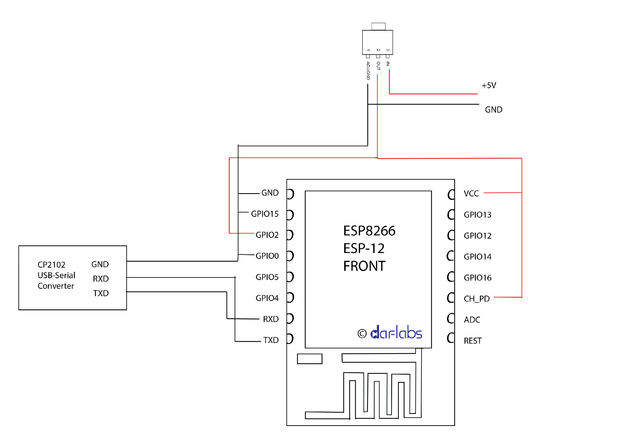
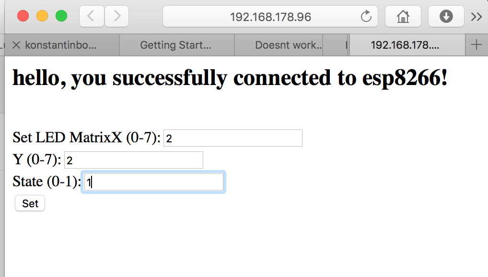
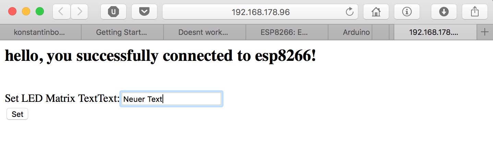

# Playground



### TODO:
+ test more than one matrix
+ use NodeMCU Board
+ NTP implementation

## 0. Connecting
Connect ESP8266 as shown below:


+ **RX/TX only for development; I used my old Arduino as a programmer(RX->RX; TX->TX)**
+ 3.3V only!
+ Connect display:
	+ DIN -> GPIO 13
	+ CS -> GPIO 4
	+ CLK -> GPIO 14

## 1. Set single pixel

Opens a webserver with the following page at `/`:


#### Used Library: 

+ <a href="https://github.com/esp8266/Arduino">All the fancy ESP8266 stuff, like webserver...</a>
+ <a href="http://wayoda.github.io/LedControl/pages/software.html">LedControl</a>

#### Reference
```
URL: /set
METHOD: POST
PARAMS: X,Y, state
```

## 2. Set scrolling text
Opens a webserver with the following page at `/`:


#### Used Library: 

+ <a href="https://github.com/esp8266/Arduino">All the fancy ESP8266 stuff, like webserver...</a>
+ <a href="https://github.com/squix78/MAX7219LedMatrix"> MAX7219LedMatrix </a>

#### Reference
```
URL: /set
METHOD: POST
PARAMS: text
```


